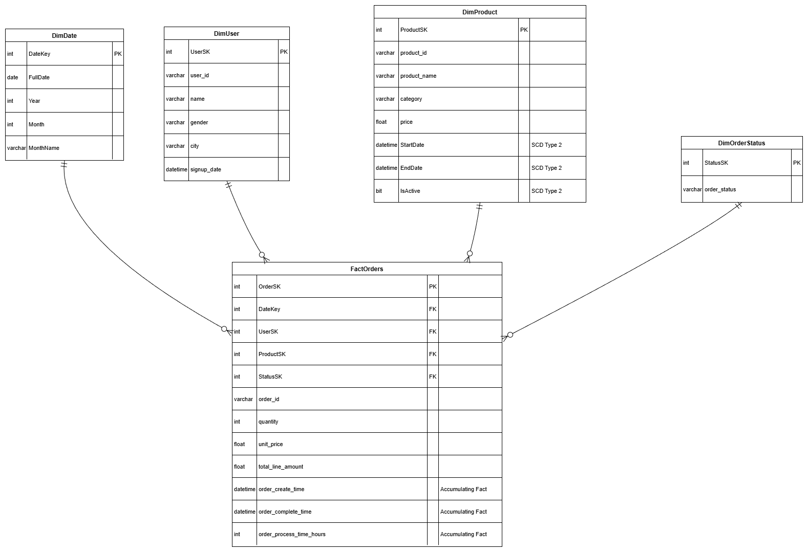
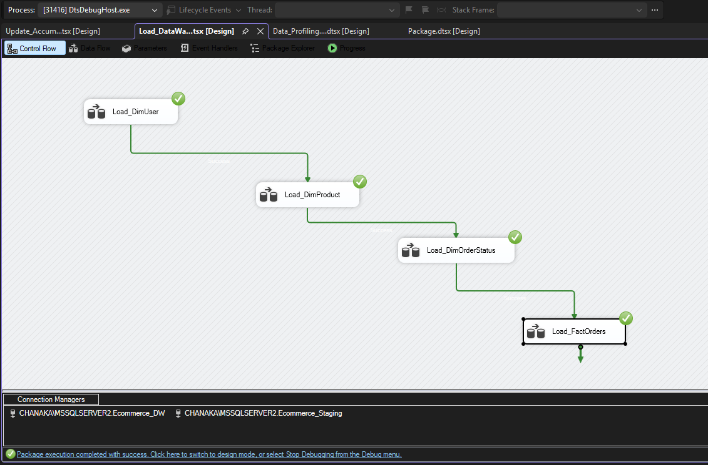
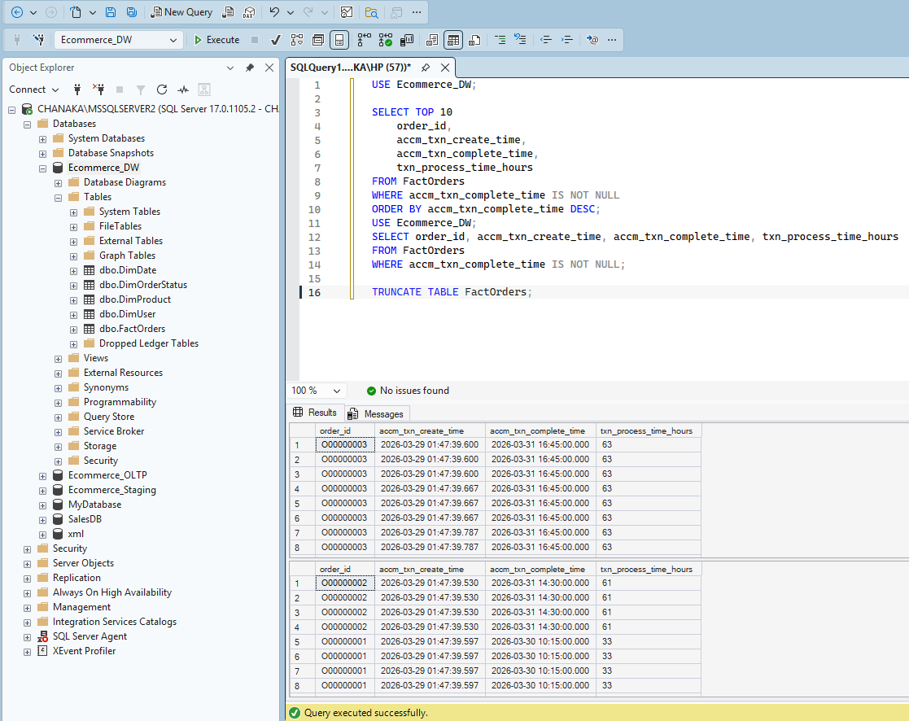
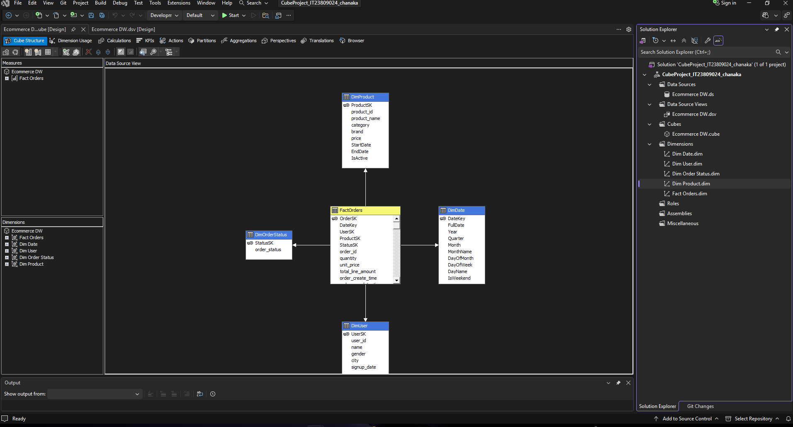
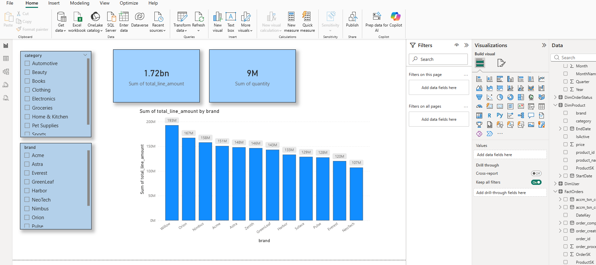
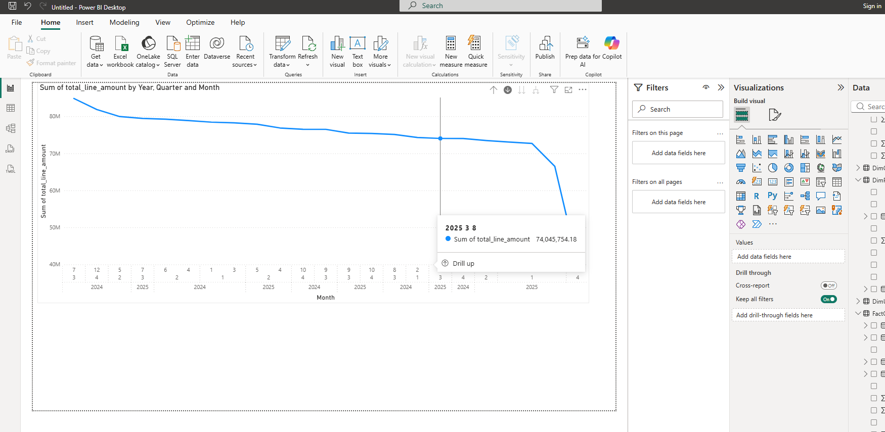
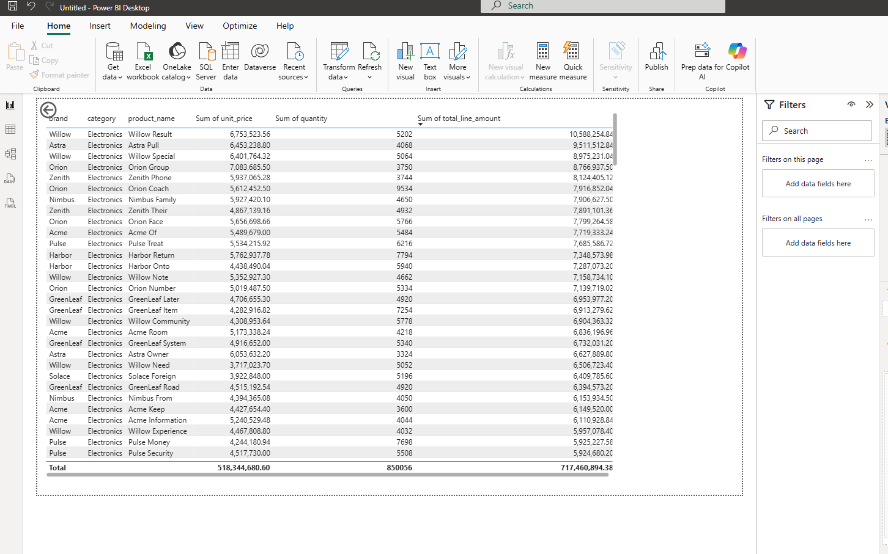

# 🚀 E-commerce Sales: End-to-End BI Solution

## 📌 Project Overview
This repository showcases a complete Business Intelligence lifecycle, transforming raw transactional data into high-level business insights. This project is specifically designed for an E-commerce retail environment using a modern Data Warehousing approach.

---

## 🏗️ Phase 1: Data Warehouse Engineering & ETL (Assignment 01)
This phase focuses on backend architecture, dimensional modeling, and the automation of data movement using **SQL Server** and **SSIS**.

### **1. Data Modeling (Star Schema)**
I designed a high-performance **Star Schema** to optimize analytical query execution. The architecture consists of a central **FactOrders** table and 4 Dimension tables.

* **Fact Table:** `FactOrders` (Measures: Quantity, Price, Fulfillment time)
* **Dimensions:** `DimUser`, `DimProduct`, `DimOrderStatus`, `DimDate`

---

### **2. ETL Pipeline & Automation (SSIS)**
Leveraging **SQL Server Integration Services (SSIS)**, I developed a robust ETL pipeline to handle data extraction from CSV/Excel, staging, and final loading.

**Technical Implementations:**
* **Slowly Changing Dimensions (SCD Type 2):** Implemented on `DimProduct` to track historical price fluctuations.
* **Accumulating Fact Logic:** Configured to measure total processing time from order creation to fulfillment.

---

### **3. Integrity & Verification**
The logic was verified through data profiling and SQL testing to ensure that historical tracking and fact calculations are 100% accurate.

---

## 🛠️ Technology Stack
* **Database:** Microsoft SQL Server (T-SQL)
* **ETL Engine:** SQL Server Integration Services (SSIS)
* **Modeling:** Dimensional Modeling (Star Schema)
* **Documentation:** [Technical Report (PDF)](Data-Engineering-ETL-project/Database-Design/IT23809024.pdf)

---

## 📂 Repository Structure (Assignment 01)
* **`/01-Data-Warehouse-Engineering/SQL-Scripts`**: T-SQL scripts for Staging and DW creation.
* **`/01-Data-Warehouse-Engineering/SSIS-Packages`**: ETL automation logic files (.dtsx).
* **`/01-Data-Warehouse-Engineering/Database-Design`**: Diagrams, screenshots, and the **Technical Report**.

---

## 📊 Phase 2: Business Intelligence & Analytical Modeling (Assignment 02)
This phase focuses on creating an analytical layer using **SSAS Cubes** and visualizing business trends via **Power BI**.

### **1. Analytical Modeling (SSAS Cube)**
To handle large-scale data analysis, I developed a Multi-Dimensional OLAP Cube.
* **Hierarchies:** Created time-series and product hierarchies for deeper analysis.
* **KPIs:** Defined calculated measures for Sales Performance and Order Fulfillment.

### **2. Interactive Dashboard (Power BI)**
The final output is an interactive dashboard featuring a modern Teal-themed aesthetic.
* **Executive Summary:** Overview of revenue, customer ratings, and volume.
* **Advanced Visuals:** Implementation of Drill-down, Drill-through, and Cross-report navigation.
* [📥 Download Power BI Report (.pbix)][(https://drive.google.com/drive/folders/1KX8M6nYm7ySayjdvSK5u42zsyBvuDLEm?usp=sharing)]

**Main Dashboard View:**

| Time-Series Analysis (Drill-Down) | Granular Product Details (Drill-Through) |
| :--- | :--- |
|  |  |

---

## 📂 Repository Breakdown (Assignment 02)
* **`/01-Source-Data`**: The original Excel dataset used for the project.
* **`/02-SSAS-Cube-Project`**: Full Visual Studio project for the OLAP cube.
* **`/03-PowerBI-Report`**: [Download .pbix File ](https://drive.google.com/drive/folders/1KX8M6nYm7ySayjdvSK5u42zsyBvuDLEm?usp=sharing)
* **`/04-Technical-Documentation`**: [Assignment 2 Full Report (PDF)](Business-Intelligence-Analytics/Technical-Documentation/DWBI_Assignment02_IT23809024.pdf)
